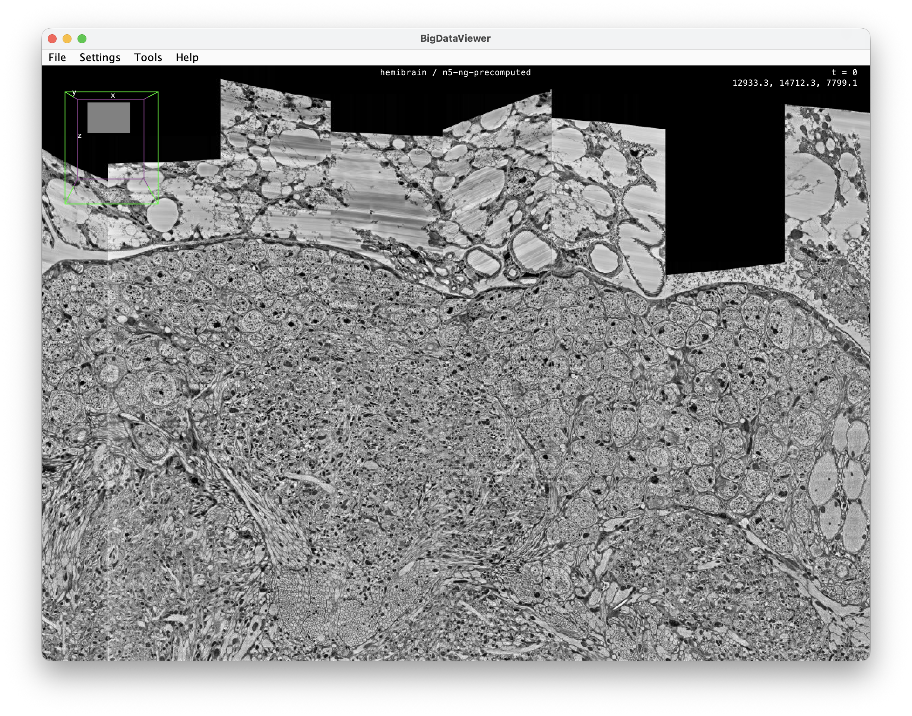
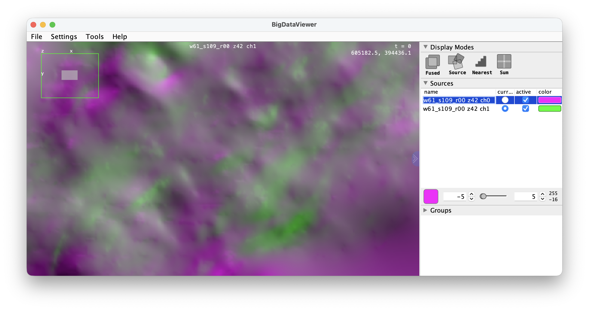

# n5-ng-precomputed

Read [Neuroglancer precomputed](https://neuroglancer-docs.web.app/datasource/precomputed/volume.html)
**volumes** through the [N5 API](https://github.com/saalfeldlab/n5) — locally or from any
cloud backend N5 supports (AWS S3, Google Cloud Storage, …).

**_Claude_** built this as a read-only counterpart to [n5-zarr](https://github.com/saalfeldlab/n5-zarr),
and closely modeled on it: the precomputed on-disk format is plugged into the same
`N5Reader` abstraction via a `KeyValueAccess`-based `PrecomputedKeyValueReader` (plus a
filesystem convenience `N5PrecomputedReader`), so precomputed volumes open with
`N5Utils`, BigDataViewer, etc., exactly like Zarr and N5.

## Usage

```java
// local
N5Reader n5 = new N5PrecomputedReader("/path/to/volume");
n5.list("/");                               // scale keys, e.g. ["8_8_8", "16_16_16", …]
RandomAccessibleInterval<?> img = N5Utils.open(n5, "8_8_8");   // [x, y, z, channel]

// cloud: pass the matching KeyValueAccess (e.g. from n5-aws-s3 / n5-google-cloud)
N5Reader n5 = new PrecomputedKeyValueReader(kva, "s3://bucket/path", new GsonBuilder(), true);
```

Each scale is a 4D `[x, y, z, channel]` N5 dataset. Precomputed raw is little-endian
Fortran `[x, y, z, channel]` order, which matches N5/ImgLib2 column-major — so, unlike
the Zarr backend, no axis reversal is performed.

## Supported

- **Encodings:** `raw`, `compressed_segmentation` (uint32/uint64), `jpeg` (uint8, 1/3
  channels), `png` (uint8/uint16, 1–4 channels).
- **Storage:** both unsharded (`xBegin-xEnd_…` chunk files) and sharded
  (`neuroglancer_uint64_sharded_v1`; `identity` and `murmurhash3_x86_128` hashes, raw/gzip
  minishard-index and data encodings). Sharded reads use byte-range requests.
- **Backends:** anything implementing N5's `KeyValueAccess`. Objects served with
  `Content-Encoding: gzip` (e.g. the GCS `info`) are handled transparently.
- Cross-validated against volumes written by Google's
  [tensorstore](https://google.github.io/tensorstore/).

## Limitations

- **Read-only** — no writing.
- **Volumes only** — no mesh / skeleton / annotation / segment-property data.
- No `compresso` or `jxl` encodings.
- The reader serves per-scale arrays and exposes `resolution` / `voxel_offset` as
  attributes; building the multiscale world transform (half-pixel and offset handling)
  is left to the consumer — see the example.
- `n5-universe`'s `N5Factory` does not know the precomputed format yet, so
  `precomputed://…` URLs are not auto-resolved (the example wires the reader up by hand).

## Try it: the hemibrain in BigDataViewer



The interactive example
[`HemibrainPrecomputed`](src/test/java/org/janelia/saalfeldlab/n5/precomputed/HemibrainPrecomputed.java)
opens the public FlyEM hemibrain EM volume (JPEG + sharded) straight from Google Cloud
Storage and shows it in BigDataViewer. It builds a multi-resolution source with the scale
factors, `0.5·(f−1)` half-pixel correction, and `voxel_offset` taken from the `info`:

```
mvn test-compile exec:java -Dexec.classpathScope=test \
  -Dexec.mainClass=org.janelia.saalfeldlab.n5.precomputed.HemibrainPrecomputed
```

It loads `precomputed://gs://neuroglancer-janelia-flyem-hemibrain/emdata/clahe_yz/jpeg`
(read anonymously).

## Try it: a deformation field in BigDataViewer

[`WarpFieldPrecomputed`](src/test/java/org/janelia/saalfeldlab/n5/precomputed/WarpFieldPrecomputed.java)
opens a public `float32`, 2-channel, sharded (`data_encoding: gzip`) warp / flow field,
takes its center z-section, and shows each displacement channel as its own lazily-rendered
2D volatile BDV source (`is2D()`, here colored magenta/green):



```
mvn test-compile exec:java -Dexec.classpathScope=test \
  -Dexec.mainClass=org.janelia.saalfeldlab.n5.precomputed.WarpFieldPrecomputed
```

## Testing

`mvn test` runs in-process round-trip tests for every encoding, unsharded and sharded.
Two opt-in tests need the network / extra tooling:

- `-Dprecomputed.gcs=true` — headless smoke test against the hemibrain bucket.
- `-Dprecomputed.python=python3` (after `pip install tensorstore numpy`) — cross-validate
  against tensorstore-written volumes.

## Building

`mvn clean install` — Java 8, depends only on the core `n5` artifact (and `imglib2`); no
cloud jars. The BigDataViewer example pulls in test-scope `n5-universe`,
`n5-google-cloud` (transitively), and `bigdataviewer-vistools`.

## License

Simplified BSD. See `doc/LICENSE.md`.
